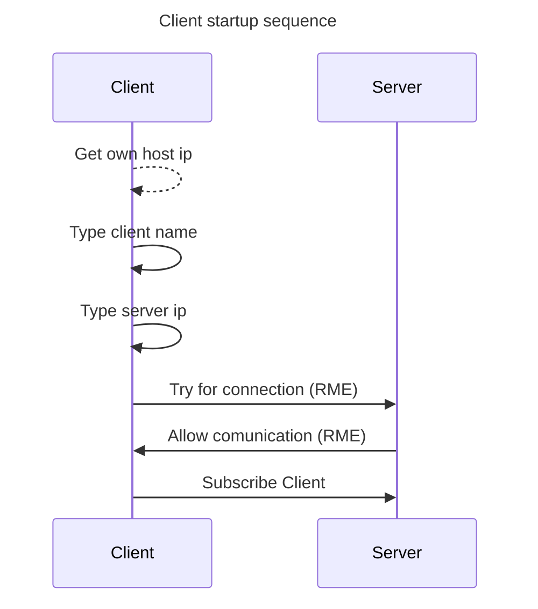
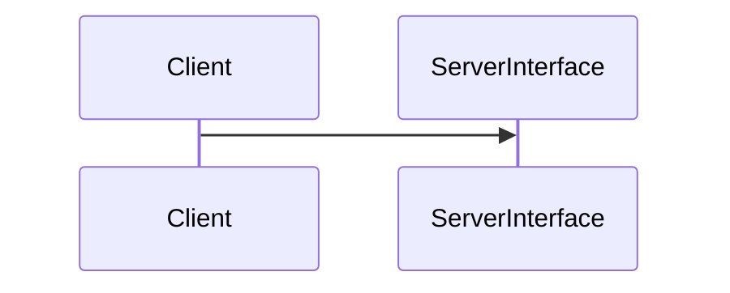
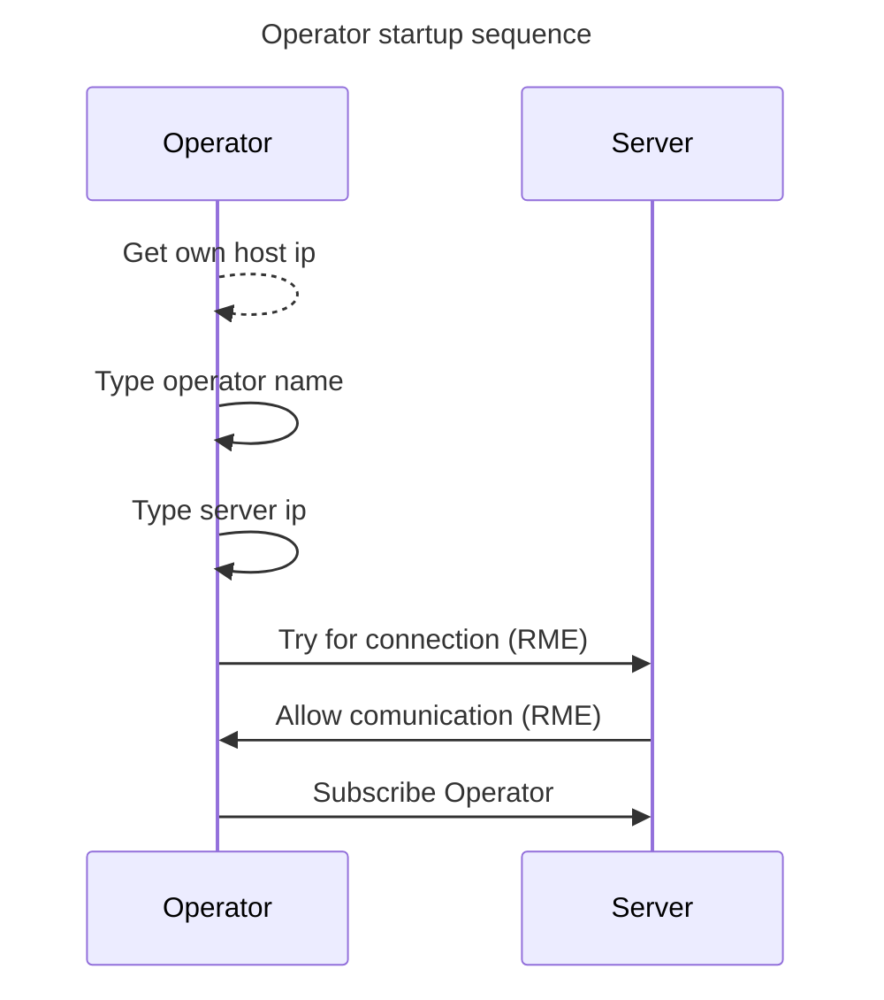
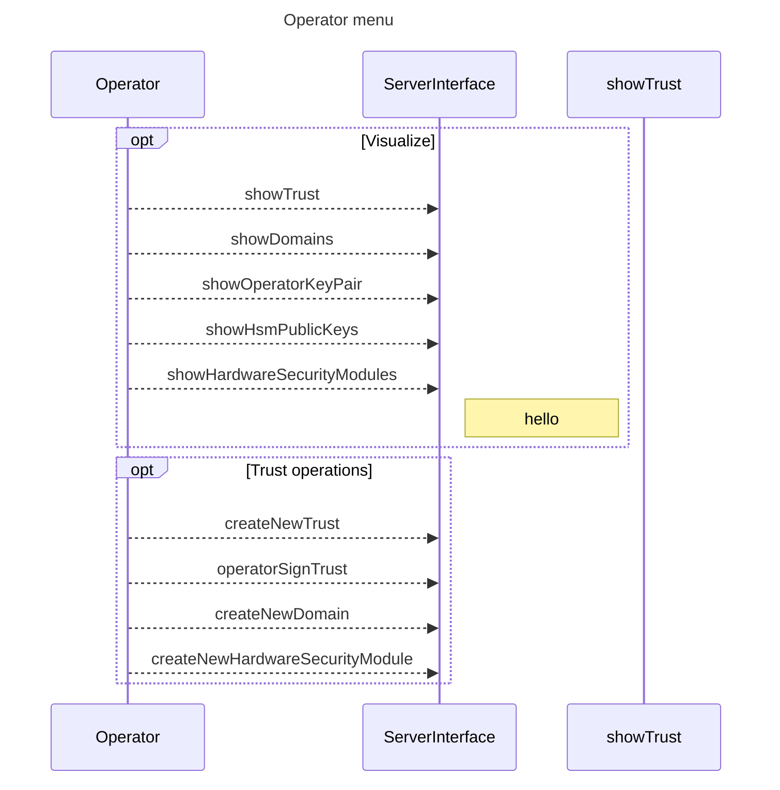
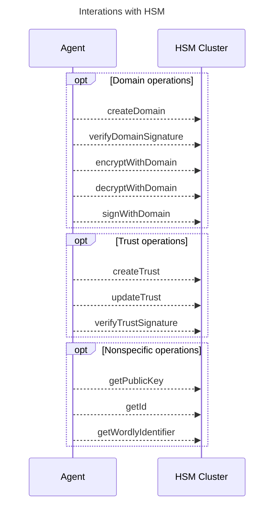

# Notes - Privacy System KMS

## General flow

## Client

### Startup process:

> 1. Get Client IP.
> 2. Type Client name.
> 3. Type Server IP to connect to.
> 4. Attempt to establish connection: 
>    - Setup system property.
>    - Setup server registry.
>    - Setup registry lookup.
> 5. Create Client object and subscribe to server.

### Client menu:

> Menu:  
> 
> 1. encrypt file with domain. 
> 2. decrypt file with domain.
> 3. Go back.

## Operator

### Startup process:

> 1. Get Operator IP.
> 2. Type Client name.
> 3. Type Server IP to connect to.
> 4. Attempt to establish connection: 
>    - Setup system property.
>    - Setup server registry.
>    - Setup registry lookup.
> 5. Create Operator object and subscribe to server.

### Operator menu:

## General functional use

## General structure

Panels
Windows
Client